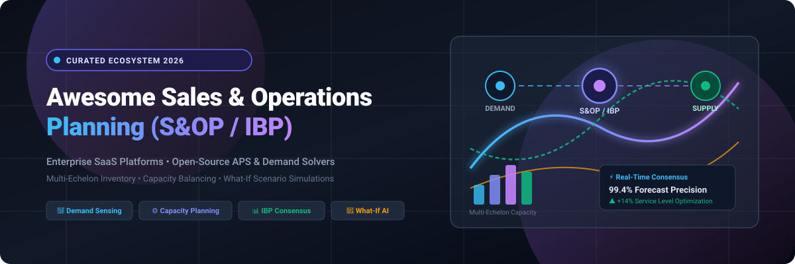
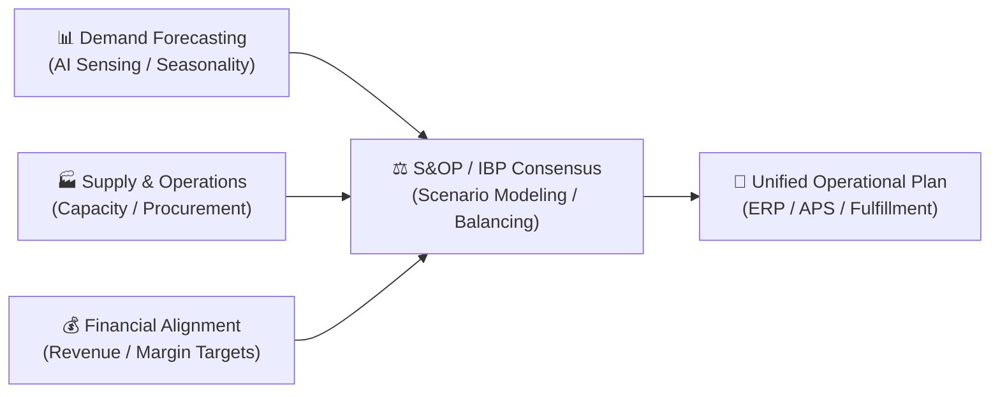

# Awesome-Sales-n-Operations-Planning

<p align="center">
  
</p>

<p align="center">
  <a href="https://github.com/ishandutta2007/Awesome-Awesome-Awesome"></a>
  <a href="https://discord.gg/jc4xtF58Ve"></a>
  <a href="https://github.com/ishandutta2007/Awesome-Sales-n-Operations-Planning/stargazers"></a>
  <a href="https://github.com/ishandutta2007/Awesome-Sales-n-Operations-Planning/network/members"></a>
  <a href="https://github.com/ishandutta2007/Awesome-Sales-n-Operations-Planning/pulls"></a>
  <a href="https://github.com/ishandutta2007/Awesome-Sales-n-Operations-Planning/blob/main/LICENSE"></a>
  <a href="https://github.com/ishandutta2007"></a>
</p>

---

## 🧭 Overview & Ecosystem Scope

> **A curated index of top SaaS enterprise suites and open-source planning engines for Sales & Operations Planning (S&OP), Integrated Business Planning (IBP), Advanced Planning and Scheduling (APS), and Demand-Supply Balancing.**

Sales & Operations Planning (**S&OP**) and Integrated Business Planning (**IBP**) align multi-echelon demand forecasts, supply chain constraints, inventory targets, production schedules, and financial P&L objectives into a continuous, cross-functional operating rhythm.



---

## 📑 Table of Contents

- [🧭 Overview & Ecosystem Scope](#-overview--ecosystem-scope)
- [🏢 SaaS & Hosted Enterprise Platforms](#-saas--hosted-enterprise-platforms)
- [💻 Open-Source GitHub Projects](#-open-source-github-projects)
- [📐 S&OP Architectural Stack](#-sop-architectural-stack)
- [❓ Frequently Asked Questions (FAQ)](#-frequently-asked-questions-faq)
- [🤝 How to Contribute](#-how-to-contribute)
- [📈 Star History](#-star-history)
- [📜 Disclaimer](#-disclaimer)

---

## 🏢 SaaS & Hosted Enterprise Platforms

> 🌐 **Market Dynamics & Sector Sizing (2025–2034)**:  
> The global **Sales & Operations Planning (S&OP) and Supply Chain Planning (SCP)** market is valued at approximately **$21.4 Billion in 2025** and is projected to expand to **$52.8 Billion by 2034** (CAGR of ~10.6%). The landscape is **moderately fragmented**: mega ERP vendors (Oracle, SAP) provide broad suite coverage, while specialized best-of-breed planning platforms (Kinaxis, Anaplan, Blue Yonder, RELEX, OMP) command high-complexity multi-echelon niches. Rather than a winner-take-all monopoly, mid-market SaaS innovators and verticalized AI forecasting tools continue to thrive alongside large suites.

*Sorted by company scale (Valuation / Market Capitalization / Annual Revenue in descending order).*

| 🏢 Platform | 🏷️ Company Size (Valuation / Revenue) | 📋 Description & Key S&OP Capabilities | 💰 Starting Pricing | 🎁 Free Tier / Free Trial Limits |
| :--- | :--- | :--- | :--- | :--- |
| **[Oracle Supply Chain Planning](https://www.oracle.com/scm/)** | **~$400B+ Market Cap**<br>*(~$53B Annual Revenue, Public: NYSE: ORCL)* | Oracle Fusion Cloud SCM suite delivering integrated demand management, constraint-based supply planning, and sales & operations planning tied directly to Oracle Cloud ERP. | Starting at **$500/month** per Hosted Named User (Oracle Demand Management / S&OP Cloud list price; 10-user minimum ~$5,000/month) | **30-Day Free Trial** with $300 cloud credits + Always Free infrastructure tier; SCM Cloud planning modules evaluated via 30-day sales-assisted sandbox |
| **[Anaplan](https://www.anaplan.com/)** | **$10.7B Valuation**<br>*(~$600M+ Annual Revenue, Thoma Bravo Portfolio)* | Hyperblock™ connected planning engine connecting operational S&OP/IBP plans with corporate financial forecasts and real-time what-if scenario simulations. | Starting at **~$30,000/year** (~$2,500/month base deployment for standard workspace and model builder licensing) | **90-Day Free Workspace Trial** for training & modeling certifications via Anaplan Talent Builder / Academy; commercial evaluation via sales POC |
| **[Blue Yonder](https://blueyonder.com/)** | **$8.5B Valuation**<br>*(~$1.3B Annual Revenue, Panasonic Subsidiary)* | End-to-end AI/ML supply chain platform offering autonomous demand forecasting, multi-echelon inventory optimization (MEIO), and factory scheduling. | Starting at **~$50,000/year** (~$4,166/month base tier for core planning modules; enterprise tiers scale by nodes and volumes) | **30-Day Guided Proof of Concept (POC)** sandbox trial upon enterprise qualification; no self-service free tier |
| **[RELEX Solutions](https://www.relexsolutions.com/)** | **~$5.7B Valuation**<br>*(~$250M+ Annual Revenue, Blackstone Backed)* | Unified retail and consumer goods supply chain platform providing automated demand forecasting, store/DC replenishment, and collaborative S&OP workflows. | Starting at **~€3,000/month** (~$39,000/year base entry tier for mid-market retail modules; scales by store & SKU count) | **30-Day Proof of Value (PoV)** pilot evaluation for qualified retail and CPG enterprise accounts; no permanent free tier |
| **[Kinaxis](https://www.kinaxis.com/)** | **~$4.2B Market Cap**<br>*(~$490M Annual Revenue, Public: TSX: KXS)* | Maestro™ (RapidResponse) concurrent planning platform providing real-time S&OP, multi-tier supply synchronization, and instant what-if scenario evaluation. | Starting at **~$50,000/year** (~$4,166/month base tier for Planning One; enterprise deployments scale to $100k–$250k+/year) | **30-Day Proof-of-Concept (POC)** sandbox and complimentary Business Performance Assessment for qualified enterprises |
| **[OMP](https://www.omp.com/)** | **~$1.0B+ Est. Valuation**<br>*(~$150M+ Annual Revenue, OM Partners)* | Unison Planning™ advanced planning and optimization (APO) suite specializing in complex process manufacturing, metals, chemicals, and consumer goods S&OP. | Starting at **~$75,000/year** (~$6,250/month base deployment for core Unison Planning modules; scaled on plants/SKUs) | **30-Day Proof of Value (PoV)** pilot sandbox environment for qualified enterprise prospects; no self-service free tier |
| **[Logility](https://www.logility.com/)** | **Multi-Hundred-Million Division**<br>*(~$180M Annual Revenue, Aptean Portfolio)* | AI-first Digital Supply Chain Platform covering demand forecasting, multi-echelon inventory management, capacity planning, and executive S&OP dashboards. | Starting at **~$40,000/year** (~$3,333/month base subscription for entry demand and inventory planning modules) | **30-Day Structured Proof of Concept (PoC)** pilot evaluation upon vendor qualification; no permanent free tier |
| **[ToolsGroup](https://www.toolsgroup.com/)** | **~$70M–$100M Revenue**<br>*(Private, Accel-KKR Backed)* | Service Optimizer 99+ (SO99+) platform using probabilistic demand planning and automated service-level optimization across volatile supply networks. | Starting at **$500/month** (Pay-As-You-Grow early tier) up to ~$35,000/year base for enterprise SO99+ platform | **30-Day Guided Proof of Concept (PoC)** trial and historical dataset modeling evaluation; no self-service free tier |
| **[John Galt Solutions](https://johngalt.com/)** | **~$40M–$60M Revenue**<br>*(Privately Held / Bootstrapped Leader)* | Atlas Planning Suite & ForecastX delivering end-to-end demand sensing, statistical modeling, supply balancing, and executive S&OP orchestration. | Starting at **$99/month** (ForecastX standalone edition) or ~$25,000/year base for Atlas Planning Suite | **15-Day Free Trial** for ForecastX standalone edition with full feature access; 30-day guided sandbox pilot for Atlas Planning Suite |
| **[Arkieva](https://arkieva.com/)** | **~$15M–$25M Revenue**<br>*(Privately Held Specialist)* | Modular supply chain planning suite delivering finite capacity scheduling, inventory optimization, multi-scenario S&OP, and replenishment planning. | Starting at **$500/month** (Arkieva+ mid-market modular tier) or ~$25,000/year base for enterprise S&OP suite | **Free Forever Plan** via standalone Swifcast tool (limited to baseline demand forecasting & ROI calculation); **14-Day Free Trial** for Arkieva+ modules |

---

## 💻 Open-Source GitHub Projects

> 💡 Open-source tools provide the mathematical foundations, time-series forecasting algorithms, linear programming solvers, and ERP backbones needed to construct custom, cost-effective S&OP pipelines.

*Sorted by GitHub Star count in descending order.*

| 📦 Repository | ⭐ Github_Stars | 🛠️ Category | 📖 Description & S&OP Planning Utility |
| :--- | :--- | :--- | :--- |
| **[odoo/odoo](https://github.com/odoo/odoo)** | <a href="https://github.com/odoo/odoo/stargazers"></a> | 🏭 ERP / MRP Engine | Full-featured open-source ERP with Material Requirements Planning (MRP), inventory tracking, and production work-center scheduling suitable for mid-market operational execution. |
| **[facebook/prophet](https://github.com/facebook/prophet)** | <a href="https://github.com/facebook/prophet/stargazers"></a> | 📈 Demand Forecasting | Fast and automated procedure for forecasting time-series data based on an additive model with non-linear trends, multi-period seasonality, and holiday effects. |
| **[google/or-tools](https://github.com/google/or-tools)** | <a href="https://github.com/google/or-tools/stargazers"></a> | ⚙️ Constraint Solver | Google's fast and portable software suite for combinatorial optimization, integer programming (CP-SAT), vehicle routing problems (VRP), and finite capacity scheduling. |
| **[sktime/sktime](https://github.com/sktime/sktime)** | <a href="https://github.com/sktime/sktime/stargazers"></a> | 🤖 ML Time-Series | Unified scikit-learn compatible Python toolbox for machine learning with time series, featuring composable forecasting pipelines, ensembling, and backtesting. |
| **[unit8co/darts](https://github.com/unit8co/darts)** | <a href="https://github.com/unit8co/darts/stargazers"></a> | 🎯 Demand Analytics | User-friendly Python library for time-series forecasting and anomaly detection, supporting classical statistical models (ARIMA, AutoARIMA) up to deep neural networks (TFT, N-BEATS). |
| **[Nixtla/statsforecast](https://github.com/Nixtla/statsforecast)** | <a href="https://github.com/Nixtla/statsforecast/stargazers"></a> | ⚡ Fast Forecasting | Blazing-fast statistical and econometric time-series models (AutoARIMA, ETS, CES, Theta) optimized to forecast millions of SKU-level demand series in seconds. |
| **[Nixtla/neuralforecast](https://github.com/Nixtla/neuralforecast)** | <a href="https://github.com/Nixtla/neuralforecast/stargazers"></a> | 🧠 Deep Learning SCM | Deep learning algorithms for time-series demand forecasting (PatchTST, NHITS, Informer, Temporal Fusion Transformers) supporting exogenous variables and multi-horizon plans. |
| **[coin-or/pulp](https://github.com/coin-or/pulp)** | <a href="https://github.com/coin-or/pulp/stargazers"></a> | 📐 Linear Programming | Python linear programming modeler used to formulate mathematical models for supply network allocation, safety-stock optimization, and transportation balancing. |
| **[metasfresh/metasfresh](https://github.com/metasfresh/metasfresh)** | <a href="https://github.com/metasfresh/metasfresh/stargazers"></a> | 🏭 Open ERP & Supply | Open-source enterprise ERP designed for fast, automated supply chains, order fulfillment, and multi-location inventory synchronization. |
| **[timefold-ai/timefold-solver](https://github.com/timefold-ai/timefold-solver)** | <a href="https://github.com/timefold-ai/timefold-solver/stargazers"></a> | 🧩 AI Planning Solver | AI constraint satisfaction engine (successor to OptaPlanner) for complex planning and scheduling problems such as shift rosters, factory operations, and vehicle routing. |
| **[frePPLe/frepple](https://github.com/frePPLe/frepple)** | <a href="https://github.com/frePPLe/frepple/stargazers"></a> | 📊 Open S&OP & APS | Dedicated open-source Advanced Planning and Scheduling (APS) and demand forecasting engine with interactive Gantt scheduling, inventory targets, and capacity planning. |
| **[Opseron/Opseron](https://github.com/Opseron/Opseron)** | <a href="https://github.com/Opseron/Opseron/stargazers"></a> | 🌐 Unified Platform | Emerging open enterprise platform combining CRM, ERP, MRP, and operations into a single collaborative planning environment. |

---

## 📐 S&OP Architectural Stack

Building a scalable S&OP / IBP architecture requires combining data integration, predictive forecasting, constraint-based balancing, and cross-functional reporting:

```
┌─────────────────────────────────────────────────────────────┐
│ 1. DATA INGESTION & SEMANTIC LAYER (ERP, CRM, WMS, POS)     │
│    Odoo / metasfresh / dbt / SQL Data Warehouses (BigQuery) │
└──────────────────────────────┬──────────────────────────────┘
                               ▼
┌─────────────────────────────────────────────────────────────┐
│ 2. DEMAND PLANNING & SENSING ENGINE                         │
│    Nixtla StatsForecast / Facebook Prophet / Darts / sktime │
└──────────────────────────────┬──────────────────────────────┘
                               ▼
┌─────────────────────────────────────────────────────────────┐
│ 3. CONSTRAINT OPTIMIZATION & CAPACITY BALANCING             │
│    Google OR-Tools / frePPLe APS / Timefold / PuLP          │
└──────────────────────────────┬──────────────────────────────┘
                               ▼
┌─────────────────────────────────────────────────────────────┐
│ 4. FINANCIAL CONSENSUS & WHAT-IF SCENARIO DASHBOARDS        │
│    Anaplan / Kinaxis Maestro / Streamlit / Superset / PowerBI│
└─────────────────────────────────────────────────────────────┘
```

---

## ❓ Frequently Asked Questions (FAQ)

<details>
<summary><b>1. What is the key difference between S&OP and IBP?</b></summary>
<p>
<b>Sales and Operations Planning (S&OP)</b> focuses primarily on balancing operational supply (manufacturing, inventory, logistics) with customer demand over a 3- to 18-month horizon. <b>Integrated Business Planning (IBP)</b> extends S&OP by tightly integrating operational metrics directly with strategic financial goals (revenue, margin, cash flow, CapEx) and executive decision-making.
</p>
</details>

<details>
<summary><b>2. Can open-source software replace commercial enterprise S&OP suites?</b></summary>
<p>
For small-to-midsize manufacturers, combining tools like <b>frePPLe</b> (for APS and forecasting), <b>Odoo</b> (for transactional MRP), and <b>Google OR-Tools</b> (for custom solvers) offers a viable, cost-effective alternative. However, global enterprises with multi-echelon global networks typically rely on commercial platforms (Kinaxis, Anaplan, Blue Yonder) for concurrent real-time recalculations, SOC2 compliance, and audit-ready governance.
</p>
</details>

<details>
<summary><b>3. What are the 5 classic steps of the S&OP monthly cycle?</b></summary>
<p>
1. <b>Data Gathering:</b> Update actual sales, inventory levels, and operational metrics.<br>
2. <b>Demand Planning:</b> Generate baseline statistical forecasts and review marketing/sales adjustments.<br>
3. <b>Supply Planning:</b> Validate production capacity, lead times, materials, and inventory targets.<br>
4. <b>Pre-S&OP Meeting:</b> Reconcile demand-supply gaps, model what-if financial scenarios, and build consensus.<br>
5. <b>Executive S&OP Meeting:</b> Finalize the authorized operating plan and capital allocations with leadership.
</p>
</details>

---

## 🤝 How to Contribute

Contributions are welcome! Please help keep this curated list up-to-date with new tools, benchmarks, and libraries.

1. 🍴 **Fork the repository** on GitHub.
2. 🌿 **Create a new branch** (`git checkout -b add-planning-tool`).
3. ✍️ **Add or edit entries** in [README.md](README.md) following the established table structure with accurate starting pricing, free tier limits, company valuation, and star badges.
4. 🚀 **Submit a Pull Request** with a concise summary of the addition.

---

## 📈 Star History

[](https://star-history.dera.page/#ishandutta2007/Awesome-Sales-n-Operations-Planning&type=date&legend=top-left)

---

## 📜 Disclaimer

- This is a **community-curated index** for informational and educational purposes. Mention of commercial products or open-source projects does not imply official endorsement or sponsorship.
- S&OP decisions directly impact working capital, customer service levels, production schedules, and business resilience. Always validate mathematical models, verify vendor commercial contracts directly, and ensure enterprise IT compliance before implementation.

---

<p align="center">
  <sub>Curated with ❤️ by <a href="https://github.com/ishandutta2007">Ishan Dutta</a> and the global supply chain community.</sub>
</p>
